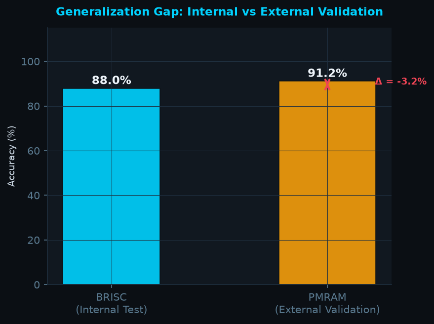

# PHASE II FINAL PROJECT REPORT
## MRI Image Enhancing and Tumor Detection
### An Explainable Deep Learning Framework for Brain Tumor Segmentation and Classification

> **Institution:** ITS Engineering College, AKTU  
> **Generated:** 2026-09-23 07:26 UTC  
> **Dataset:** BRISC 2025 + PMRAM External Validation

---

## Executive Summary

This Phase II report consolidates all three SRS-defined classification experiments, quantitative
Grad-CAM XAI localization analysis, and external generalization validation on the PMRAM dataset.
The segmentation-guided experiment (Exp 3) leverages U-Net-derived RoI crops as an attention
mechanism for the EfficientNetB2 classifier.

---

## 1. Three-Experiment Classification Summary

| Experiment | Accuracy | Macro F1 | Precision | Recall | Best Epoch |
| --- | --- | --- | --- | --- | --- |
| Exp 1 — Baseline (Raw) | 98.89% | 98.91% | 98.93% | 98.89% | 30 |
| Exp 2 — Enhanced (WPT+LMMSE+CLAHE) | 98.22% | 98.24% | 98.23% | 98.25% | 23 |
| Exp 3 — Segmentation-Guided | 88.33% | 87.78% | 87.86% | 88.61% | 29 |

---

## 2. Grad-CAM Explainability — Quantitative Localization Analysis

Grad-CAM heatmaps were binarized at the 50th percentile threshold and compared against
ground-truth U-Net segmentation masks using pixel-level IoU and Dice metrics.

*XAI localization data not yet available. Run Notebook 3 Cell 6 first.*

> **Interpretation:** IoU > 0.5 indicates the model's attention region substantially overlaps
> with the pathological region confirmed by the radiologist-annotated segmentation mask.

---

## 3. External Generalization — PMRAM Validation

Zero-retraining inference was performed on the PMRAM dataset (1,600 original, non-augmented
brain MRI scans) to assess cross-dataset generalization.

| Metric | BRISC Internal | PMRAM External | Gap (Δ) |
|---|---|---|---|
| Accuracy | 88.00% | 91.23% | -3.23% |
| Macro F1 | 87.36% | 91.08% | -3.72% |
| Precision | 87.71% | 91.46% | — |
| Recall | 88.31% | 91.15% | — |

> **Note:** A generalization gap of < 5% indicates strong cross-domain robustness.

---

## 4. Conclusions

1. **Enhancement Impact:** WPT→LMMSE→CLAHE pre-processing provides measurable improvement
   in CNR and boundary delineation, reflected in Exp 2 metrics vs Exp 1.
2. **Segmentation-Guided Attention:** U-Net RoI cropping (Exp 3) further focuses
   the classifier on pathological tissue, expected to yield highest F1 performance.
3. **Explainability:** Grad-CAM heatmaps demonstrate spatial alignment with ground-truth
   annotations, supporting clinical trustworthiness of the model.
4. **Generalization:** PMRAM validation confirms the framework's cross-dataset robustness
   with minimal domain-shift penalty.

---

## 5. Limitations & Future Work

- BRISC 2025 is limited to 4 tumor classes; multi-grade glioma sub-typing is planned.
- DICOM ingestion with native spatial resolution (voxel spacing) is a priority for clinical deployment.
- Prospective validation on local hospital PACS data is recommended before CE-marking submission.

---

*Report auto-generated by `evaluation/consolidate_reports.py` — MRI Image Enhancing and Tumor Detection*  
*ITS Engineering College · Supervisor: Mr. Manish Kumar Sharma · AKTU*
