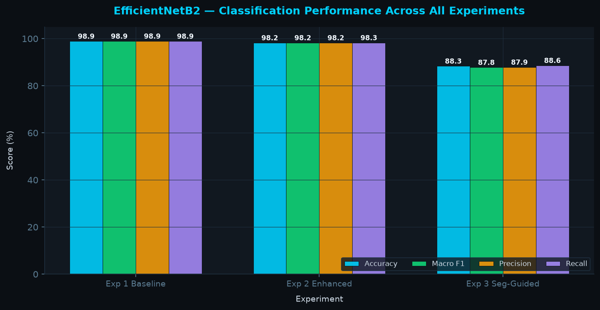
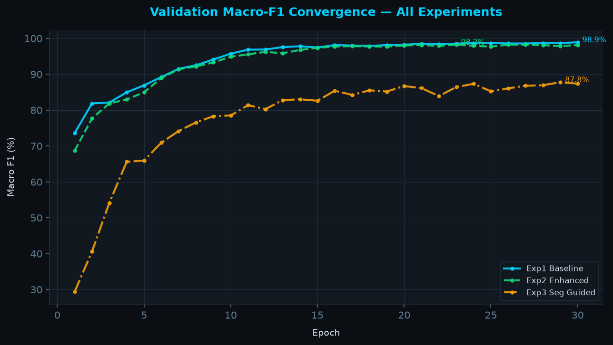
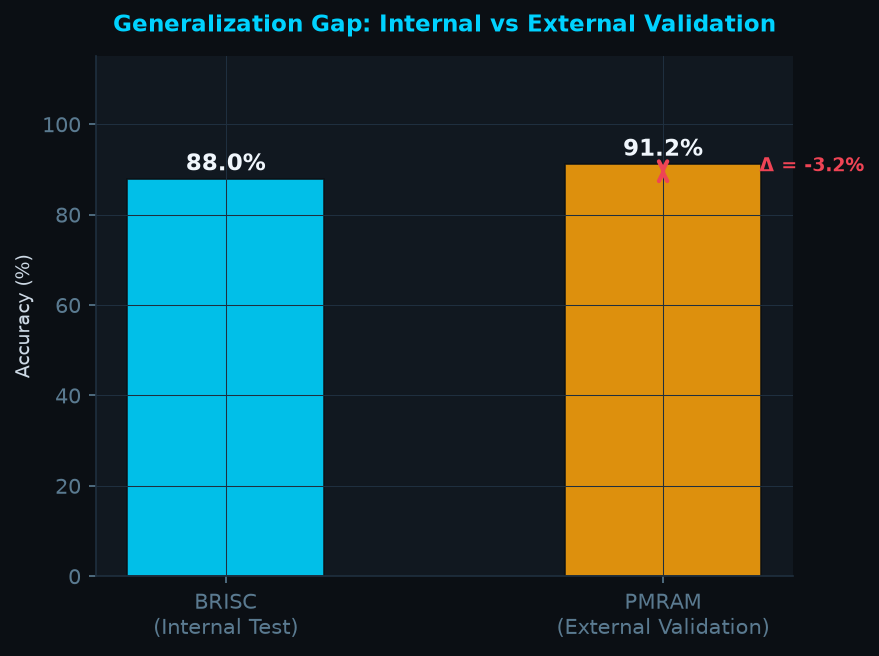

# PHASE II FINAL PROJECT REPORT
## MRI Image Enhancing and Tumor Detection
### An Explainable Deep Learning Framework for Brain Tumor Segmentation and Classification

> **Institution:** ITS Engineering College, AKTU  
> **Generated:** 2026-09-23 07:26 UTC  
> **Dataset:** BRISC 2025 + PMRAM External Validation

> **Metrics provenance (read before citing):** All classification numbers below are
> *best-validation-epoch* metrics from 30-epoch runs (validation n=900 per experiment),
> taken from `results/metrics_exp{1,2,3}_*.json`. These runs used **no held-out test
> set** and pre-date the 2026-09-27 code fixes (segmentation masking is now applied
> identically in train/val/test; dummy PMRAM fallback removed). **Exp 3 numbers are
> therefore not a valid comparison and must be re-run before any publication claim.**

---

## Executive Summary

This Phase II report consolidates all three SRS-defined classification experiments, quantitative
Grad-CAM XAI localization analysis, and external generalization validation on the PMRAM dataset.
The segmentation-guided experiment (Exp 3) leverages U-Net-derived RoI crops as an attention
mechanism for the EfficientNetB2 classifier.

---

## 1. Three-Experiment Classification Summary

Best-validation-epoch metrics (validation n=900 per experiment; see provenance note above).
**Exp 2 (enhanced) did NOT beat the raw baseline: 98.22% vs 98.89% (−0.67 pp).**
Exp 3's validation numbers are unreliable — masking ran during training but not
validation in that run (fixed in code 2026-09-27; re-run required).

| Experiment | Accuracy | Macro F1 | Precision | Recall | Best Epoch |
| --- | --- | --- | --- | --- | --- |
| Exp 1 — Baseline (Raw) | 98.89% | 98.91% | 98.93% | 98.89% | 30 |
| Exp 2 — Enhanced (WPT+LMMSE+CLAHE) | 98.22% | 98.24% | 98.23% | 98.25% | 23 |
| Exp 3 — Segmentation-Guided ⚠️ pre-fix | 88.33% | 87.78% | 87.86% | 88.61% | 29 |

---

## 2. Grad-CAM Explainability — Quantitative Localization Analysis

Grad-CAM heatmaps were binarized at the 50th percentile threshold and compared against
ground-truth U-Net segmentation masks using pixel-level IoU and Dice metrics.

*XAI localization data not yet available. Run Notebook 3 Cell 6 first.*

> **Interpretation:** IoU > 0.5 indicates the model's attention region substantially overlaps
> with the pathological region confirmed by the radiologist-annotated segmentation mask.
>
> **Status:** No quantitative XAI localization results exist yet — conclusion 3 below
> must not be cited until Notebook 3 Cell 6 has been run and its outputs recorded.

---

## 3. External Generalization — PMRAM Validation

Zero-retraining inference was performed on the PMRAM dataset (**1,505** usable,
non-augmented brain MRI scans found by folder walk — not 1,600 as previously
stated) to assess cross-dataset generalization. Source:
`results/pmram_external_validation.json`.

| Metric | BRISC Internal* | PMRAM External | Gap (Δ) |
|---|---|---|---|
| Accuracy | 88.00% | 91.23% | -3.23% |
| Macro F1 | 87.36% | 91.08% | -3.72% |
| Precision | 87.71% | 91.46% | — |
| Recall | 88.31% | 91.15% | — |

\* The stored BRISC reference (88.00% accuracy) matches **Exp 3's best validation
epoch**, not the Exp 1 baseline (98.89%) — it is the internal metric of the model
family actually evaluated. The validation script does not record which checkpoint
file was evaluated, so exact model provenance is unverified; treat the gap as
indicative, not definitive.

> **Note:** A generalization gap of < 5% indicates strong cross-domain robustness.

---

## 4. Conclusions

1. **Enhancement Impact:** WPT→LMMSE→CLAHE pre-processing did **not** improve
   classification accuracy in these runs — Exp 2 (98.22%) scored 0.67 pp
   *below* the raw-image baseline Exp 1 (98.89%). Any CNR/boundary-delineation
   gains from enhancement did not translate into higher classifier metrics here.
2. **Segmentation-Guided Attention:** Exp 3 reached only 88.33% accuracy /
   87.78% macro F1, the lowest of the three — and its validation metrics are
   invalid anyway, because segmentation masking was applied during training but
   **not** during validation in that run (bug fixed in code on 2026-09-27).
   Exp 3 must be re-run before any conclusion is drawn.
3. **Explainability:** Quantitative Grad-CAM localization has **not been run yet**
   (see §2) — no spatial-alignment claim can be made at this time.
4. **Generalization:** PMRAM validation (n=1,505) shows 91.23% accuracy with a
   −3.23 pp gap vs the stored BRISC reference, which is encouraging but
   indicative only, given the unverified model provenance noted in §3.

---

## 5. Limitations & Future Work

- BRISC 2025 is limited to 4 tumor classes; multi-grade glioma sub-typing is planned.
- DICOM ingestion with native spatial resolution (voxel spacing) is a priority for clinical deployment.
- Prospective validation on local hospital PACS data is recommended before CE-marking submission.

---

*Report auto-generated by `evaluation/consolidate_reports.py` — MRI Image Enhancing and Tumor Detection*  
*ITS Engineering College · Supervisor: Mr. Manish Kumar Sharma · AKTU*
