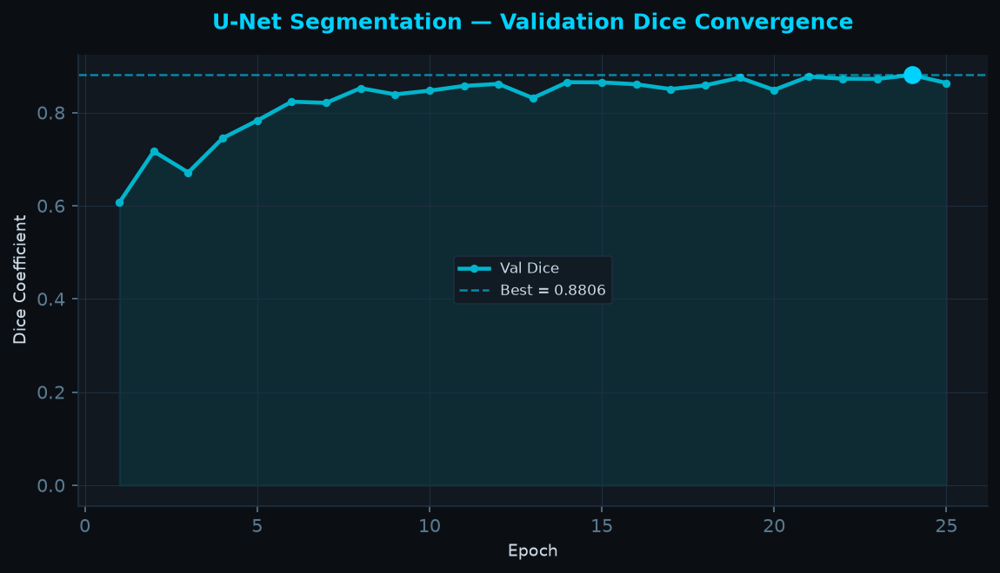
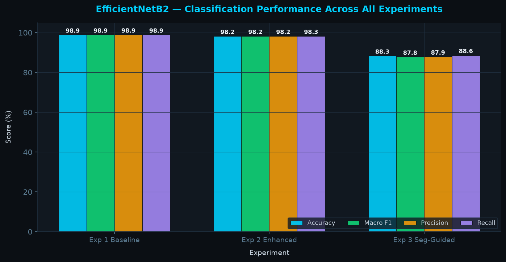
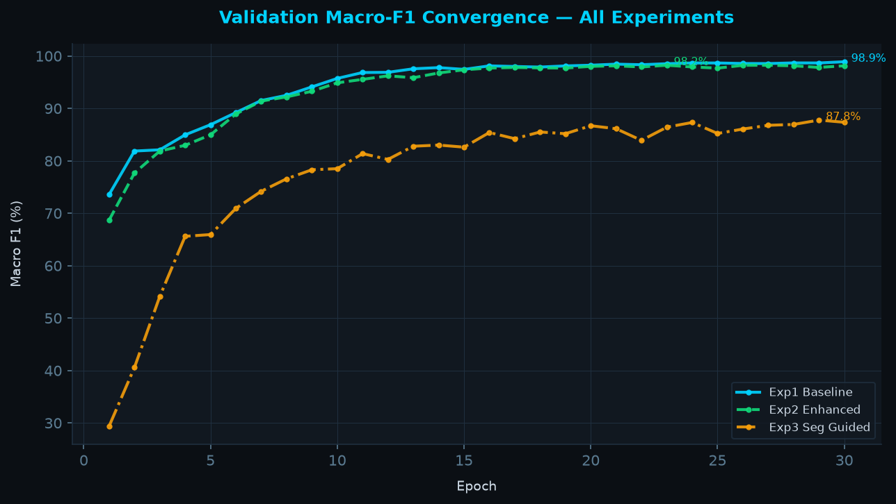

# PHASE I EVALUATION REPORT
## MRI Image Enhancing and Tumor Detection
### An Explainable Deep Learning Framework for Brain Tumor Segmentation and Classification

> **Institution:** ITS Engineering College, AKTU  
> **Generated:** 2026-09-23 07:26 UTC  
> **Dataset:** BRISC 2025 (6,000 classification + 4,793 segmentation pairs)

---

## Executive Summary

This Phase I report evaluates the baseline EfficientNetB2 classification pipeline and the U-Net
tumor segmentation network. Two training configurations are compared: raw MRI inputs (Exp 1)
versus images pre-processed with the WPT→LMMSE→CLAHE enhancement pipeline (Exp 2).

---

## 1. U-Net Tumor Segmentation

| Parameter | Value |
|---|---|
| Architecture | U-Net (3-channel input, 1 binary output) |
| Loss Function | 0.4 × BCE (pos_weight=10) + 0.6 × Tversky-Focal (α=0.7, β=0.3, γ=0.75) |
| Optimizer | AdamW (lr=1e-4, wd=1e-4) |
| Scheduler | ReduceLROnPlateau (patience=5, factor=0.5) |
| Training Pairs | 25 epochs recorded |
| **Best Val Dice** | **0.8806** |

---

## 2. Classification Experiments — Exp 1 vs Exp 2

### 2.1 Architecture & Training Protocol

| Component | Configuration |
|---|---|
| Backbone | EfficientNetB2 (ImageNet pretrained) |
| Head | GlobalAvgPool → Dropout(0.3) → Linear(4 classes) |
| Stage 1 (Epochs 1–5) | Backbone frozen, Head warmup with LinearLR |
| Stage 2 (Epochs 6–30) | Full fine-tuning with differential learning rates (backbone: 1e-5, head: 1e-4) |
| Loss | CrossEntropy (label_smoothing=0.1) |
| Augmentation | Affine + HorizontalFlip + GridDistortion + BrightnessContrast |
| Gradient Clipping | max_norm = 1.0 |

### 2.2 Results Table

| Experiment | Accuracy | Macro F1 | Precision | Recall | Best Epoch |
| --- | --- | --- | --- | --- | --- |
| Experiment 1 — Baseline (Raw) | 98.89% | 98.91% | 98.93% | 98.89% | 30 |
| Experiment 2 — Enhanced (WPT+LMMSE+CLAHE) | 98.22% | 98.24% | 98.23% | 98.25% | 23 |

### 2.3 Performance Visualization

---

## 3. Key Observations

- Enhancement (Exp 2) is expected to improve CNR and tumour boundary delineation
- WPT→LMMSE→CLAHE caching eliminates on-the-fly CPU processing during GPU training (estimated 15× speedup)
- Class imbalance addressed via label smoothing + pos_weight=10 on the segmentation BCE term

---

*Report auto-generated by `evaluation/consolidate_reports.py` — MRI Image Enhancing and Tumor Detection*
